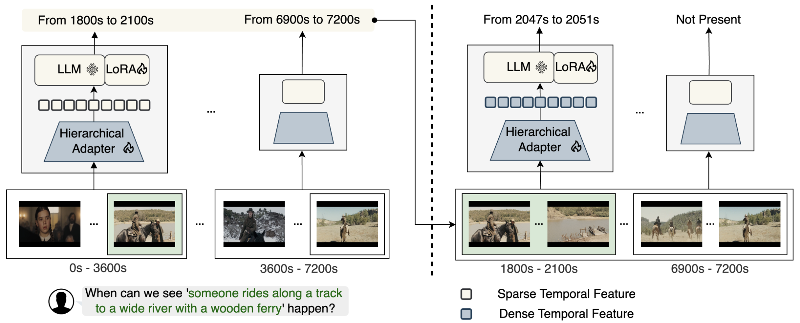
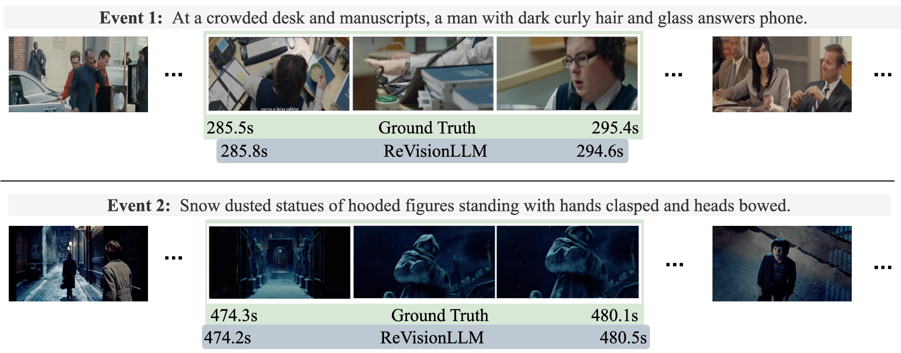

# ReVisionLLM
[ReVisionLLM: Recursive Vision-Language Model for Temporal Grounding in Hour-Long Videos](https://arxiv.org/pdf/2411.14901) 

Tanveer Hannan Md Mohaiminul Islam  Jindong Gu Thomas Seidl Gedas Bertasius

Accepted by **CVPR 2025**

[//]: # ([[Website]&#40;https://sites.google.com/view/rgnet&#41;] [[Paper]&#40;https://arxiv.org/pdf/2312.06729&#41;])

[//]: # (Official PyTorch implementation of the paper "RGNet: A Unified Clip Retrieval and Grounding Network for Long Videos".)


[](https://paperswithcode.com/sota/natural-language-moment-retrieval-on-mad?p=revisionllm-recursive-vision-language-model)

[](https://paperswithcode.com/sota/language-based-temporal-localization-on?p=revisionllm-recursive-vision-language-model)

---

## :loudspeaker: Latest Updates
- **Mar-03**: The trained models weights are available [here](https://drive.google.com/drive/folders/19wqQ5QWijClP8XaWd031eAK6hGQA_7mX?usp=share_link) 
- **Mar-03**: Released the training and evaluation code.
- **Feb-27**: ReVisionLLM is accepted to CVPR 2025! :fire::fire:
---

## ReVisionLLM Overview :bulb:

ReVisionLLM is a recursive vision-language model designed to locate events in hour-long videos. Inspired by human search strategies, our model initially targets broad segments of interest, progressively revising its focus to pinpoint exact temporal boundaries. Our model can seamlessly handle videos of vastly different lengths, from minutes to hours. We also introduce a hierarchical training strategy that starts with short clips to capture distinct events and progressively extends to longer videos. ReVisionLLM is the first VLM capable of temporal grounding in hour-long videos.

[//]: # (![framework]&#40;images/main.png&#41;)


---

## Contributions :trophy:

- We extend the existing VLMs to enable temporal grounding capabilities in hour-long videos.
- We propose a vision-language model that recursively processes hour-long videos for effective and efficient hourlong video processing.
- We propose a progressive training strategy, where the model is first trained to identify events in short video segments, then progressively scales to hour-long videos, enabling it to effectively handle longer, more complex video
sequences.
- Our model significantly outperforms previous state-ofthe-art approaches, surpassing specialized models and
other Vision-Language Models (VLMs) on multiple datasets by a substantial margin. 

---

## Installation :wrench:
We recommend setting up a conda environment for the project:
```shell
conda create --name=revisionllm python=3.10
conda activate revisionllm

git clone https://github.com/Tanveer81/ReVisionLLM.git
cd ReVisionLLM
conda install pytorch==1.13.1 torchvision==0.14.1 torchaudio==0.13.1 pytorch-cuda=11.6 -c pytorch -c nvidia
pip install -r requirements.txt
```
Additionally, install additional packages for training cases.
```shell
pip install ninja
pip install flash-attn==2.5.6 --no-build-isolation
```

## Process MAD Dataset:
- Follow [RGNet](https://github.com/Tanveer81/RGNet) to download and extracted features for the MAD Dataset and put them in /data/mad/ folder.
- Run the following commands to extract more features
```shell
python revisionllm/data/mad/mad_to_activitynet.py
python revisionllm/data/feature_extraction/mad_clip_text_extractor.py
```
## Process VidChapters-7M Dataset:
- Follow [VidChapters-7M](https://github.com/antoyang/VidChapters) to download the VidChapters-7M Dataset and put that in /data/chapters/ folder.
- Run the following commands to extract features
```shell
python revisionllm/data/feature_extraction/chapters_clip_text_extractor.py
python revisionllm/data/vidchap7m/chapters_clip_extractor.py
python revisionllm/data/vidchap7m/chapters_test_to_activitynet.py
python revisionllm/data/vidchap7m/chapters_to_activitynet.py
```

[//]: # (## Process MSRVTT Dataset:)

[//]: # (- Follow [CLIP4Clip]&#40;https://github.com/ArrowLuo/CLIP4Clip&#41; to download the MSRVTT Dataset and put that in /data/chapters/ folder.)

[//]: # (- Run the following commands to extract features)

[//]: # (```shell)

[//]: # (python revisionllm/data/retrieval/msrvtt/msrvtt_retrieval_to_activitynet.py)

[//]: # (python revisionllm/data/retrieval/msrvtt/msrvtt_clip_extractor.py)

[//]: # (python revisionllm/data/feature_extraction/msrvtt_clip_text_extractor.py)

[//]: # (```)

## Download Encoder And LLM Weights
Follow [VTimeLLM](https://github.com/huangb23/VTimeLLM/blob/main/docs/train.md) to download CLIP, Vicuna-v1.5, Stage-1 and Stage-2 weights and place them in /checkpoints folder.

## Training on MAD Dataset:
```shell
sh scripts/mad/stage1_dense.sh
sh scripts/mad/stage1_sparse.sh
sh scripts/mad/stage2_long_33.sh
sh scripts/mad/stage2_long_100.sh
```

## Inference on MAD Dataset:
```shell
bash scripts/mad/eval_loop_stage1_dense.sh
bash scripts/mad/eval_stage2_33.sh
bash scripts/mad/eval_stage2_100.sh
python revisionllm/eval/metric_retrieval_forward.py
```

## Training on VidChapters7M Dataset:
```shell
sh scripts/chapters/stage1_dense.sh
sh scripts/chapters/stage1_sparse.sh
sh scripts/chapters/stage2_long_100.sh
```

## Inference on VidChapters7M Dataset:
```shell
bash scripts/chapters/eval_loop_stage1_dense.sh
bash scripts/chapters/eval_stage2_100.sh
python revisionllm/eval/metric_retrieval_forward_chapters.py
```

## Qualitative Analysis :mag:

A Comprehensive Evaluation of ReVisionLLM's Performance on MAD Datasets.

[//]: # (![framework]&#40;images/main.png&#41;)


---


## Acknowledgements :pray:

We are grateful for the following awesome projects our ReVisionLLM arising from:

* [LLaVA](https://github.com/haotian-liu/LLaVA): Large Language and Vision Assistant
* [FastChat](https://github.com/lm-sys/FastChat): An Open Platform for Training, Serving, and Evaluating Large Language Model based Chatbots
* [Video-ChatGPT](https://github.com/mbzuai-oryx/Video-ChatGPT): Towards Detailed Video Understanding via Large Vision and Language Models
* [LLaMA](https://github.com/facebookresearch/llama): Open and Efficient Foundation Language Models
* [VTimeLLM](https://github.com/huangb23/VTimeLLM): Video moment understanding and reasoning model.
* [VidChapters7M](https://github.com/antoyang/VidChapters): A large-scale dataset of user-chaptered videos
* [MAD](https://github.com/Soldelli/MAD): A Scalable Dataset for Language Grounding in Videos from Movie Audio Descriptions

If you're using ReVisionLLM in your research or applications, please cite using this BibTeX:
```bibtex
@article{hannan2024revisionllm,
  title={ReVisionLLM: Recursive Vision-Language Model for Temporal Grounding in Hour-Long Videos},
  author={Hannan, Tanveer and Islam, Md Mohaiminul and Gu, Jindong and Seidl, Thomas and Bertasius, Gedas},
  journal={arXiv preprint arXiv:2411.14901},
  year={2024}
}
```

## License :scroll:
<a rel="license" href="https://creativecommons.org/licenses/by-nc-nd/4.0/"></a> 

This work is licensed under a <a rel="license" href="http://creativecommons.org/licenses/by-nc-nd/4.0/">Creative Commons Attribution-NonCommercial-NoDerivs 4.0 International License</a>.


Looking forward to your feedback, contributions, and stars! :star2:

